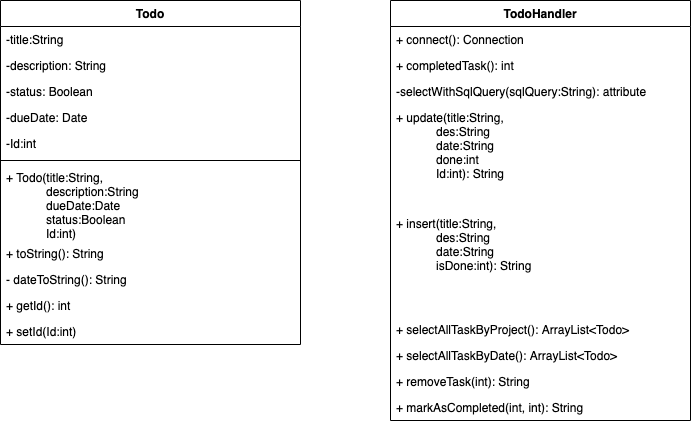

# IP_Project
## Project description
The task is to build a todo list application. The application will allow a user to create new tasks, assign them a title and due date, and choose a project for that task to belong to. They will need to use a text based user interface via the command-line.
Once they are using the application, the user should be able to also edit, mark as done or remove tasks. They can also quit and save the current task list to file, and then restart the application with the former state restored.
## Requirement
* Model a task with a task title, due date, status and project.
* Display a collection of tasks that can be sorted both by date and project. 
* Support the ability to add, edit, mark as done, and remove tasks. 
* Support a text-based user interface Load and save task list to file.'

## UML class diagram

## User manual
The program text/console base application. A user is provided with choices to pick from and a corresponding number to those choices.
#### You are provided with the follow option at program start
> Welcome to ToDoLy
* You have X tasks todo and Y tasks are done!
* Pick an option:
1) Show Task List (by date or project)
2) Add New Task
3) Edit Task (update, mark as done, remove)
4) Save and Quit
 
 Pick your choice and follow the instruction
 
## General Comment
I used JDBC sqlite to store data.